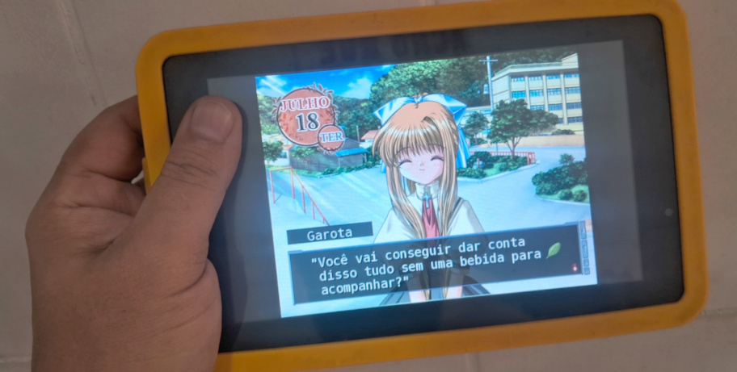

# O que é rlvm?

O rlvm (RealLive Virtual Machine) é uma reimplementação em código aberto da engine RealLive, usada nas visual novels da Key/VisualArt’s (Kanon, AIR, CLANNAD, Little Busters! etc).
Para maiores informações sobre as VNs suportadas e código fonte, acesse: https://github.com/eglaysher/rlvm.

# rlvm-android
Port do rlvm para Android. Maiores informações em: https://github.com/xyzz/rlvm-android.

# rlvm-android-pt-br

Modificação do port para facilitar a aplicação dos patches de tradução pt-br da [Taiyaki Club](https://taiyakiclub.wordpress.com/) e [Kikachan Games](https://kikachangames.github.io/projetos/).

## Implementações
- Fonte modificada embutida.
- Atualização de sdk para rodar em versões mais atuais do Android.

## Jogos traduzidos suportados
- Kanon
- AIR
- CLANNAD

## Como usar
- Instale o .apk.
- Nas configurações do Android, dê permissão para o rlvm acessar as pastas.
- Abra o rlvm e selecione a pasta onde estão os arquivos do jogo com o patch previamente aplicado.

## Bugs conhecidos
Kanon e AIR usam a mesma fonte modificada. Então, na prática, você pode usar a mesma versão do rlvm para rodar os patches de ambas as traduções.
CLANNAD utiliza outra fonte e você precisará da versão específica para rodar o patch. Certamente o android não irá permitir a instalação de dois rlvm*.apk. Nesse caso, seja paciente, termine um jogo antes de iniciar outro :relaxed:.

:warning: Abrir outras VNs com nossos apk modificados poderão ocasionar em erros nos textos, já que embutimos fonte com substituição de caracteres para suportar acentuação em nossas traduções.

## Quero desenvolver minha própria versão do rlvm-android
Dê uma olhada em https://github.com/AndnixSH/APKToolGUI.
